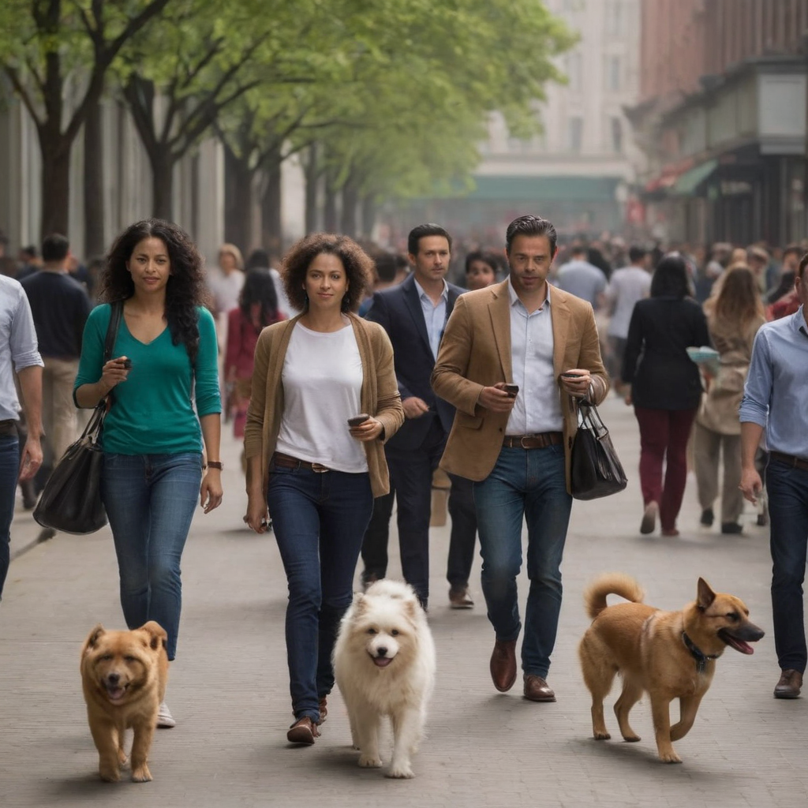
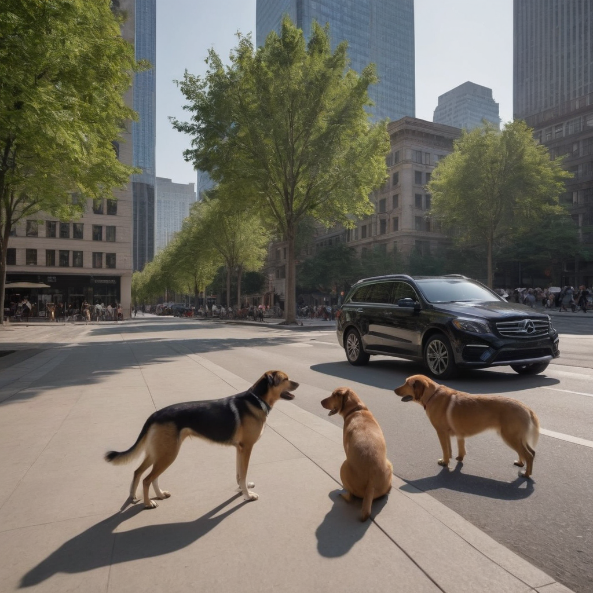
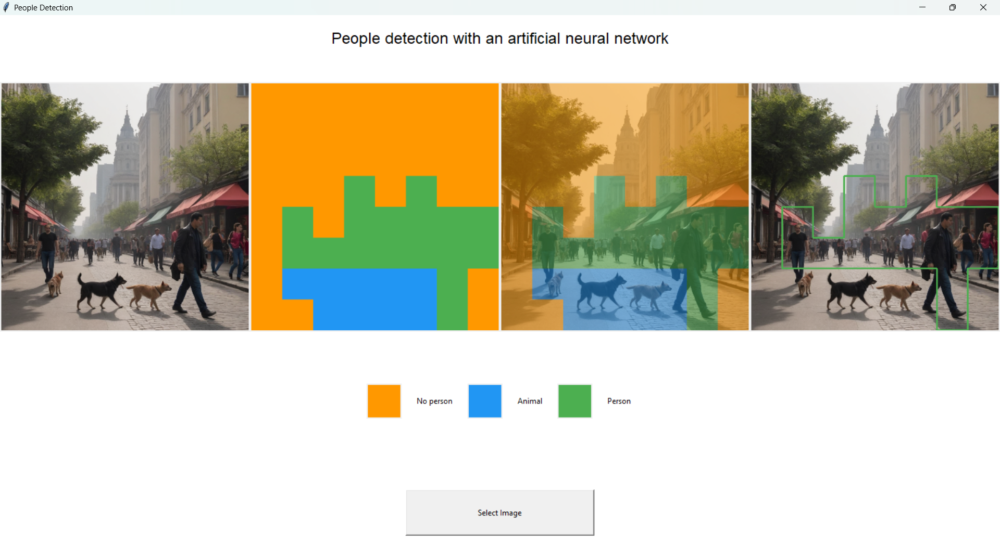
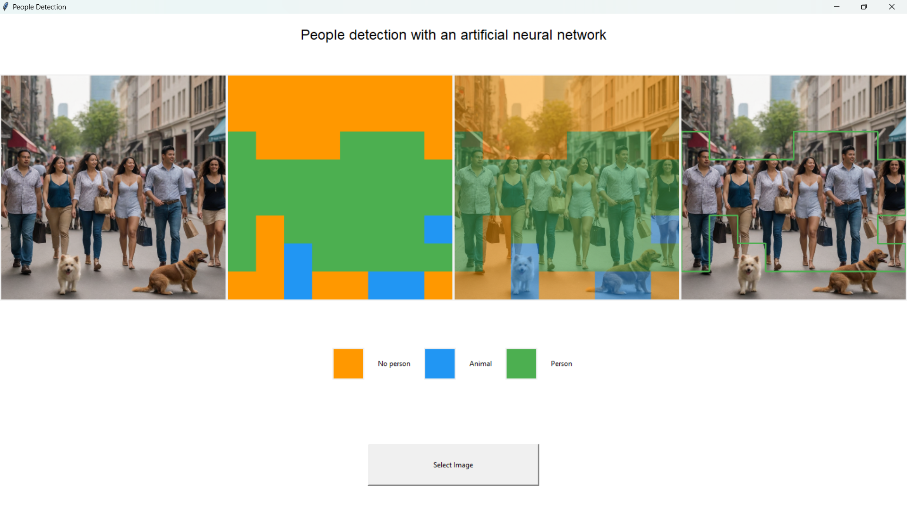
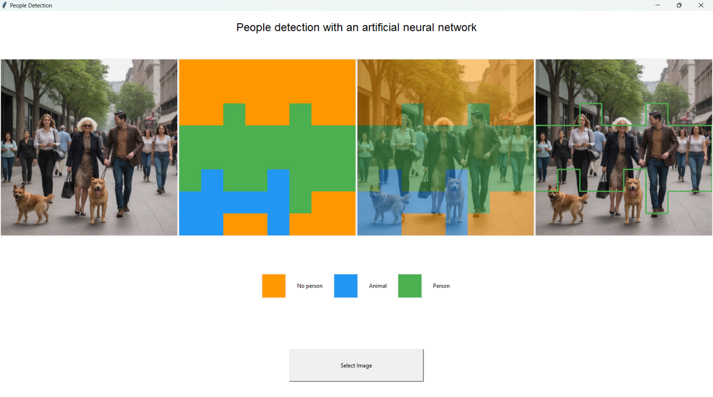
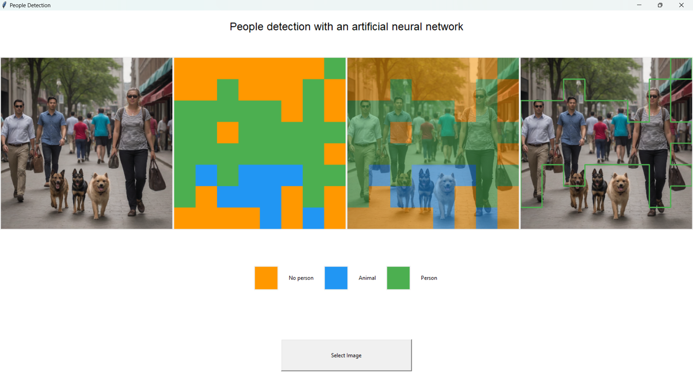

# People Detection Using Artificial Neural Networks

## Project Overview
This project demonstrates the implementation of an Artificial Neural Network (ANN) to detect people in urban environments using custom-extracted image features. The ANN is trained on a dataset consisting of images categorized into scenes with people and without people but with animals.

## Authors
- [Álvaro García Vásquez](https://github.com/AlvaroVasquezAI)
- [Luis Alfredo Cuamatzi Flores](https://github.com/mexboxluis)
- [Fernando Daniel Portilla Posadas](https://github.com/Makinadefuego)

## Table of Contents
1. [Dataset](#dataset)
2. [Image Features](#features)
3. [Labeling Images](#labeling)
4. [Data Splitting and Cross-Validation](#splitting)
5. [Finding the Best Hyperparameters](#hyperparameters)
6. [Training Methodology](#training)
7. [Training Model](#model-training)
8. [Using the Model (App)](#using-app)
9. [Results Using the App](#results-app)

## Dataset
The dataset comprises 200 images split into two main categories:
- **V1**: Images with people and animals (100 images)
- **V2**: Images with animals but without people (100 images)

Each image is processed through a custom tool that divides the image into 128x128 grids and labels each grid with one of the following classifications: Absent (A), Animal (N), Noise, and People (P). The grids are stored in respective folders according to their labels.

### Folder Structure
- `dataset/`
  - `V1/` (with people and animals)
    - `output/`
      - `A/` (Absent)
      - `N/` (Animal)
      - `Noise/`
      - `P/` (People)
  - `V2/` (without people but with animals)
    - `output/`
      - `A/` (Absent)
      - `N/` (Animal)
      - `Noise/`
      - `P/` (People)
     

## Image Features
The following features are extracted from each grid for training the neural network:
- **Color Channels (R, G, B)**: Basic color information which is crucial for identifying elements like clothing or skin tones.
- **RGB Mean**: Gives a general idea of the predominant color tone, useful for differentiating background.
- **RGB Mode**: Helps identify the most common colors, useful for recognizing typical clothing colors.
- **RGB Variance & Standard Deviation**: Measures color variability which can highlight significant details within the grid.
- **Color Histogram**: Analyzes the distribution of color intensities, essential for segmentation based on color.
- **Gray Level Co-occurrence Matrix Properties**: Provides texture information from the image which is critical for pattern recognition.
- **Local Binary Patterns**: Useful for texture classification and differentiating between objects and their surroundings.
- **Histogram of Oriented Gradients (HOG)**: Effective for detecting human forms in various poses.
- **Peak Local Max**: Detects key points in the image, aiding in feature matching and scene understanding.

## Labeling Images

## Data Splitting and Cross-Validation
We employ a standard 80-20 split for training and testing our model, ensuring the dataset is diverse and representative of real-world scenarios. Additionally, we use 5-fold cross-validation to verify the robustness of our ANN model.

## Finding the Best Hyperparameters
We explore various combinations of hyperparameters to optimize our ANN's performance. This includes testing different numbers of layers, neurons, learning rates, and more.

## Training Methodology
Our training approach focuses on minimizing overfitting while maximizing the predictive accuracy of our neural network by adjusting epochs, batch sizes, and regularization methods.

## Training Model
We provide detailed steps on how the model is trained, including code snippets and explanations of each stage of the training process.

## Using the Model (App)
Description of how the model has been integrated into a user-friendly application for real-time people detection.

## Results Using the App
We present a comprehensive review of the application's performance, showcasing the effectiveness of our trained model in practical scenarios.

## Contributing
Contributions to this project are welcome! Please fork the repository and submit a pull request with your enhancements.

## License
This project is licensed under the terms of the MIT license.
